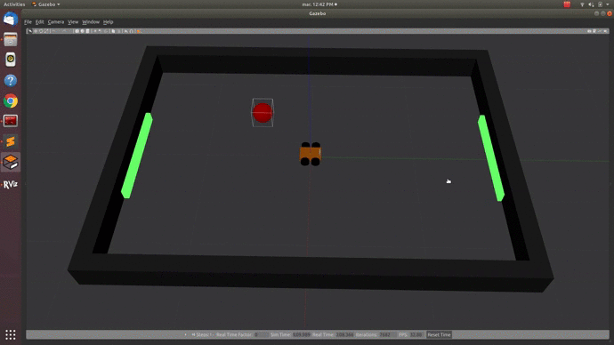
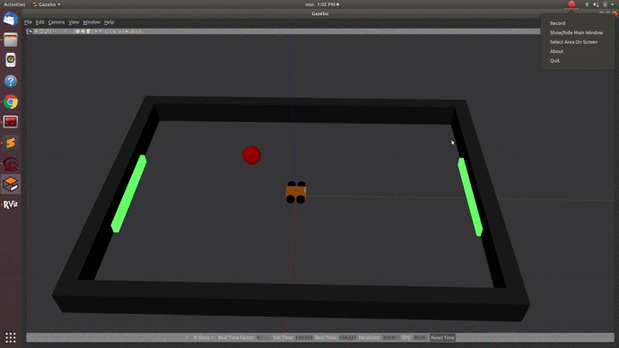
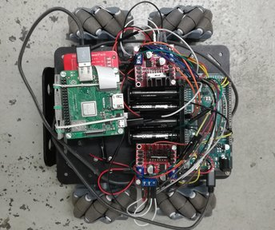
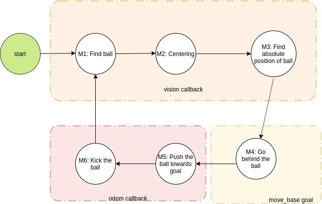
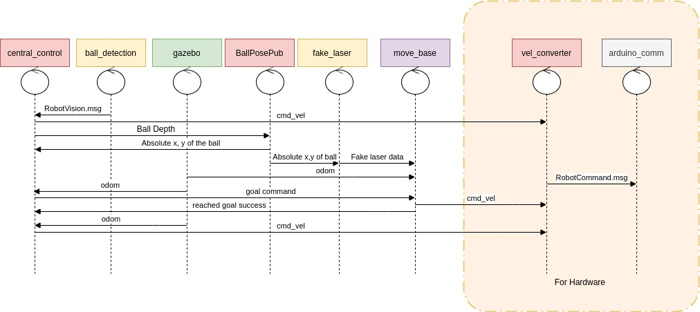
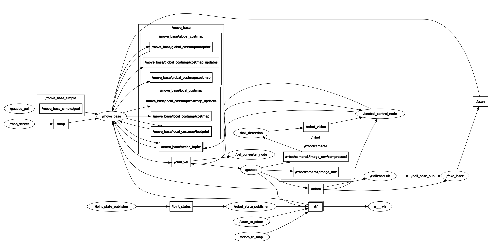

# SoccerForOmmiDriveRobot

**Aim**: Build a ROS-based software architecture that allows a 4 wheel holonomic robot to detect a red ball and push it into a green goal. The robot must execute all the necessary operations inside an arena of a fixed area. 

  <p align="center">
  
 </p>
   <p align="center">
  
 </p>

###  Constraints 

- Dimension of the arena:   240 cm x 360 cm
- Dimension of the goal:    120 cm (rectangular shape)
- Diameter of the ball:    20 cm 
- Dimension of the robot:   all the information can be found at this [link](https://www.amazon.com/OSOYOO-Robotic-Mecanum-Platform-Raspberry/dp/B07WZJYVB5/?tag=tkm05-20)
- Position of the camera:   at the center of the robot direct on the *x-axis* with height of 6 cm from the floor
- Dimention of the image:   320 X 240 with 30 fps

 ### Assumptions
 
 - The absolute position of the robot is known in real time( with help of *motion capture system*)   
 - The goal position is known and does not change. 
 - No other obstacle are present inside the arena apart from the ball.
 
 ### Implementation
 
 The implementation of this project has been done in three parts. First, buidling the robot. Second, implementing a robot simulation and the desired software architecture. Finally, integrating the hardware and software togther. 
 
 #### Hardware Components
 
 <p align="center">
  
 </p>
 

 - **4 DC motors** of 9.0V and Gear Ratio of 1/75 
 - **4 Mechanum wheels**
 - **Arduino due**
 - **2 H-bridge**
 - **Battery pack** of 12 V
 - **Raspberry Pi 3** model A+
 - **RPi UPS POWERPACK** for raspberry
 - **Raspberry Pi Camera V2**
 
 <p align="center">
  
 </p>
 
 ## 1. Software Components
 
 The software as been designent to implement a finite state machnine with six steps.
 
 
 ### 1.1 Main actions
 
 The code can be logically divided into the following main is objectives:
 
 1. Search Objective: Seach for the ball by rotating in positive z direction 
 2. Detect Objective: Detect the ball with help of OpenCV 
 3. Camera Centring Objective: Control the robot to keep the camera on the center of the ball 
 4. Ball Position Objective: Estimate the ball position using robot 2d pose and distance between ball and the robot 
 5. Navigatio Objective: Use move_base for navigation to desired goal position 
 6. Push Ball Objective: Push the ball towards the goal 
 7. Kick Ball Objective: Kick the ball when the robot is sufficiently close to the goal
 
 ### 1.2 Finite state machine
  
  <p align="center">
  
 </p>
 
 1. **MISSION 1**: Search objective is performed with help of Detection Objective for Ball
 2. **MISSION 2**: Camera Centring Objective with help of Detection Objective for Ball 
 3. **MISSION 3**: Ball Position Objective performed using the robot pose from odometry and intrinsic camera parameter to calculate the distance between camera and ball.
 4. **MISSION 4**: Navigatio Objective is performed by setting a desired goal behind the ball for move_base. The goal is calculated such that the robot's x-axis is aligned with the vector joining the Ball's position and Goal(green square) position. 
 5. **MISSION 5**: Push Ball Objective is performed such that the Ball remains at the center of the camera as well as robot's x-axis is aligned with the vector between robot's position and Goal position 
 6. **MISSION 6**: Once the robot is sufficiently close to the Goal, Kick Ball Objective is performed by speeding up the robot to maxium speed for few seconds. 
 
 
  ### 1.3 Nodes diagram 
 
 <p align="center">
  
 </p>
 
- **central_node**: The central_node is the main node which implements all the mission of the finite state machine. It subscribes to odometry from gazebo and vision data from ball_detection. It is also a service client for BallPosePub and a action client for move_base. 
- **ball_detection**: The ball_detection node subscribes to camera topics and checks if the ball is in the camera image. If the ball is present then it publishes the to /robot_vision (RobotVision.msg ) with ball status as true. It pusblished the radius and center of the ball in the image. Otherwise, a empty msg with status false is published. 
- **gazebo**: It provides the simulation and odometry (/odom)
- **BallPosePub**: This node has service server for getting the request of Ball's absolute position calculation from central_server. The central_server provides the details of the Ball's image as a request. Based on odometry and camera intrisic parameters, the absolute position of the ball is calculated. The publisher in this node publishes the recently calculated Ball position for the fake_laser node. 
- **fake_laser**: Takes the absolute Ball position and converts it into a fake laser data. The laser is assumed to be at the ceneter of the map with frame "odom". 
- **move_base**: move_base is used for path planning in mission phase 4. It takes action request from central_node to reach a desired goal postion for the robot. This goal position in our case is calculated as explained in Mission 4 above. 
- **vel_converter**: The vel_converter is used when working with the robot hardware. It maps the vel_cmd(Twist) into strings for communication with arduino. 
- **arduino_comm**: This node stablishes a connection with arduino and sends the values published by vel_converter to arduino board. 

 ### 1.4 rqt_graph 
 
  <p align="center">
  
 </p>
 
 
 
 ## 2. Description of the packages
 
 #### 2.1 myrobot_gazebo
 This package contains all the setting for gazebo in order to run the simulation.
 
 - our world that simulates the arena with the real dimension:
   - four walls
   - two nets
   - one red ball
   
 - robot with the real dimension: 
   - chassis
   - wheels
   - position of the camera
   
 - dimension of the image:
   - width: 320
   - height: 240
   
   
 #### 2.2 robot_map    
 This package contains the 2D map of the arena. The map is centered in the center of the gazebo environment. 
    
 #### 2.3 robot_vision
 
 This package contains two nodes:
 - *example_ball*: this node allows to:
   - detect the red ball
   - estimate the radius of ball
   - estimate the distance from the robot and the ball
  
  - *fake_laser*: this node allow to simulate the information received from a laser with a position in the center of the environment. This information is important to fill the laser information topic needed as input of the mave_base package
  
 #### 2.4 navigation
 
 This package contains all the packages for the navigation of the robot:
 
 - *move_base*: description of the package at [roswiki documentation](http://wiki.ros.org/move_base)
 - *costmap_2d*: description of the package at [roswiki documentation](http://wiki.ros.org/costmap_2d)
 
 #### 2.5 robot_control
 
 This package contains the nodes necessary for controlthe robot 
 
 #### 2.6 launch_pkg
 
 
 
 
 ## 3 How to run the code
 
 ### 3.1 Dowload the project
 
 ```
  1. git clone https://github.com/astha736/SoccerForOmniDriveRobot.git    
  ```
 
 ### 3.2 Set up the communication with Raspberry
 To run the project we have to set the communication between the PC and raspberry since the latter has limited resources and is not able to do operations that are computationally expensive.
 **REMARK:** it's important that all the nodes use the same master 
 
 #### PC side
 
 - **terminal 1:** running the master of the communication
 ```
  1. roscore    
  ```
  inside this terminal you can find the ROS_MASTER_URI
  
  
 - **terminal 2:** allow to publish directly /cmd_vel from terminal 
  ```
  1. export ROS_IP= <IP of PC>
   ```
   ```
  2. rostopic pub /cmd_vel geometry_ms/Twist  '{linear:  {x: 0.0, y: 0.0, z: 0.0}, angular: {x: 0.0,y: 0.0,z: 0.0}}'
   ```
   

 #### Raspberry side
 ```
 1. ssh pi@raspberrypi.local
 ```
 ```
 2. PASS: raspberry
 ```
 ```
 3. cd catkin_ws
 ```
 ```
 4. ifconfig  
 ```
 in order to find the IP of raspberry
 ```
 5. export ROS_IP= <IP of rasperry>
 ```
 ```
 6. export ROS_MASTER_URI= <URI of the master running on the PC>
 ```
 ```
 7. rosrun control_arduino arduino_comm.py
 ```
 
 
 ### 3.4 Run the project
 
 - **terminal 1:** 
 ```
 roslaunch launch_pkg gazebo_robot.launch
 ```
  - **terminal 2:**
 ```
 roslaunch launch_pkg all_other.launch
 ```
 
 **REMARK:**  make sure that inside this launch file the following nodes are decommented:
- central_control_node
- ball_detection
- BallPosePub
- fake_laser
- vel_converter_node


 ## 4 Implementation 
 
 ### 4.1 Problems
 
  1. communication between raspberry and arduino is really affected by the velocity of the connection on which the two devices are connected. Moreover, even with a stable wifi connection, the communication has delay (around 1 s). This means that the robot is not as reactive as the simulation.
 
 2. motors cannot rotate at the maximum speed when the battery pack that power on the two H-bridge is low of battery.
 
 3. motors do not have the same exact rpm and this produces an error on the trajectory of the robot that is accumulated during time. So theoretically, the more the robot is running and the bigger is the trajectory error.
 
 
 ### 4.2 Solution
 
 For problems *1* and *2* up to now there still no solution, instead for problem *3* the solution is given by the structure of the software architecture. Recalling that our code is based on the knowledge of absolute position of the robot provided in real time by the *motion capture system*, during each missions the robot is able to correct the trajectory in real time.
 
 
 
 

 
 
 
 

 
 
 
 
 
 
 
 
    
